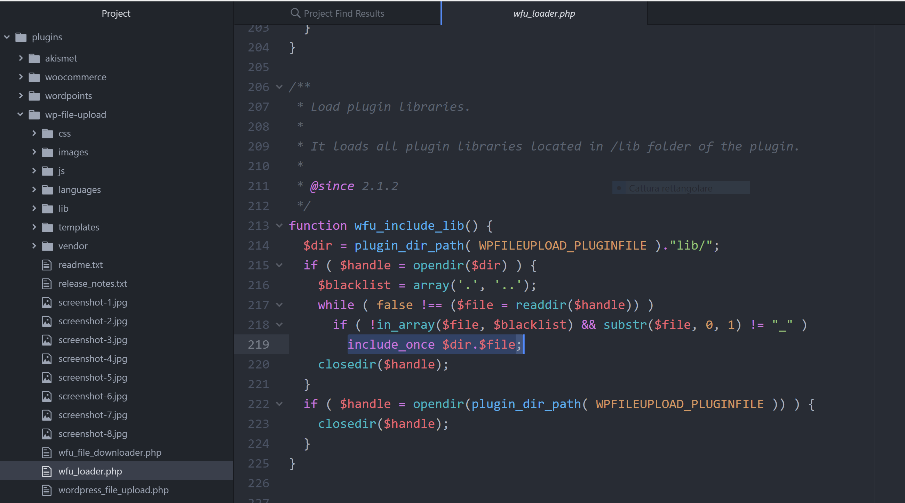

## CVE-2020-10564
### Author: p4w
### Twitter: https://twitter.com/p4w16
### HTB: https://www.hackthebox.eu/profile/32300
### e-mail: riccardo.krauter@gmail.com

* plugin url: https://wordpress.org/plugins/wp-file-upload/#developers
* fixed version 4.13.0
* CVE-2020-10564 (Directory Traversal on WP File Upload to RCE)

The vulnearbility affecting the plugin let a user gain __Remote Code Execution__ by uploading a simple `.jpg` or `.txt` file by abusing a __directory traversal__.<br>
__WordPress File Upload__ is a plugin for __WordPress__. I manage to find a directory traversal vuln. on the file upload functionality.
It's possible to use this vulnerability to gain RCE by uploading a file (doesn't matter the extension) inside the `lib` directory of the plugin.
The RCE can be triggered from an unathenticated user, also it doesn't require any admin interaction.
<br>
Why this work?
<br>
Well, thnx to this:

this piece of code shows that the function `wfu_include_lib()` will `include_once` all the file in the `lib` directory (extension does not matter). Then we can use the __path traversal__ to wrtite a file inside that directory to __gain RCE__. This function will be called automatically every time the plugin is present in a page by the init page (you can check the file `wfu_loader.php`).
<br>
<a href="./report.md">Here</a> you can find the report that I shared with the mainteiner of the plugin, inside it you can find the PoC to reproduce the issue.
<br>
<a href="./exploit.py">Here</a> you can find a simple python script exploit.
Example usage:
```
$ python exploit.py http://localhost/wordpress/test-wp-file-upload-plugin/ /wordpress
```
Enjoy the own4ge.

Cheers,
p4w
