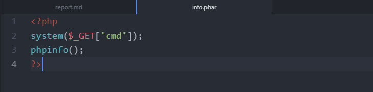
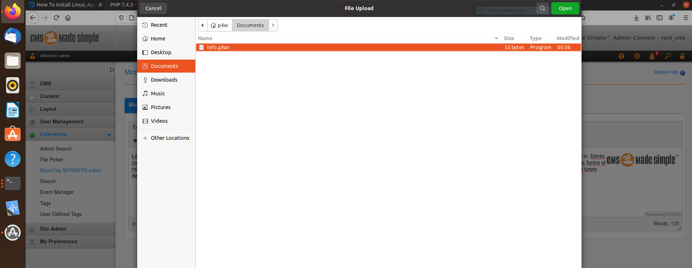

## File upload bypass with .phar extension lead to RCE
### Author: Riccardo Krauter @ [SOTER IT Security](https://soteritsecurity.com)
### Summary
The vulnerability affect the `FilePicker` module, it is possible to bypass the restriction and upload a malicious file with `.phar` extension to gain Remote Code Execution

### Steps to reproduce the issue
Prepare a PoC file with `.phar` extension with arbitrary php code in it.

Login into the admin area and surf to the `MicroTiny WYSIWYG editor` functionality then click on the __insert/edit image__ button. The screenshot below shows this steps.

A new window will be opened, now click on the search button, the `CMSMS File Picker` will be shown.

Now the `FilePicker` module will be used. Click on the upload button.

Select the `.phar` malicious file.

The file should be uploaded.

Surf to the `.phar` file to gain RCE.

The exploit is working because the upload handler checks only if the extension contains the `php` string (obviously `phar` does not match).
The exploit works fine on a standard Ubuntu system, here the configuration used for the tests:

* Linux ubuntu 5.4.0-58-generic
* php version 7.4.3
* Apache/2.4.41 (Ubuntu)
* File Picker version = "1.0.5"
