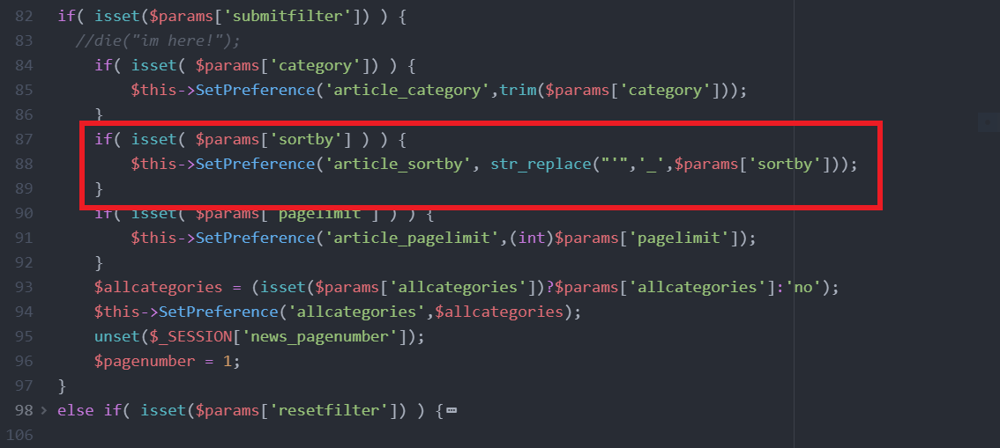
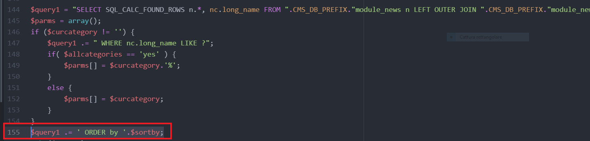
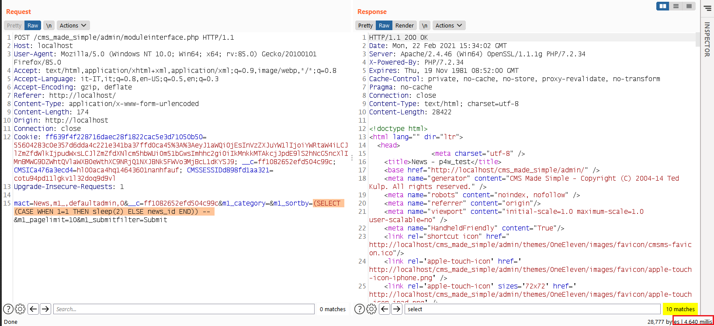

## SQL injection

### Author: Riccardo Krauter @ [Soter IT Security](https://soteritsecurity.com) 

The vulnerability is located in the `modules/News/function.admin_articlestab.php` file.

The `sortby` parameter is sanitized by replacing the `'` with the `_` character. As it is possible to notice the `$sortby` variable is concatenated with `$query1`, but it is possible to inject arbitrary SQL language without using the `'`.
As proof of concept, please consider the following screen-shot

Notice that the server will sleep for 4 seconds since the query has two results (row).

* time based payload payload: `(SELECT (CASE WHEN 1=1 THEN sleep(2) ELSE news_id END)) -- `
